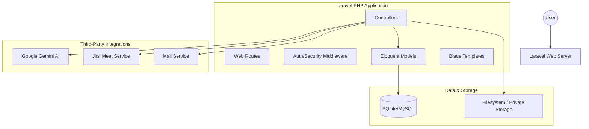

# Architecture Overview

LingoPulse follows a standard **Laravel Monolith** architecture, utilizing a "Stateful Dashboard" approach for Student, Teacher, and Admin interfaces.

## 🏗 High-Level Structure

## 🧱 Design Patterns

### 1. Model-View-Controller (MVC)
The core of the application logic is built on MVC principles. 
- **Models**: Located in `app/Models/`, representing entity schemas and relationships.
- **Views**: Located in `resources/views/`, using Blade for server-side rendering.
- **Controllers**: Located in `app/Http/Controllers/`, handling user input and coordinating data flow.

### 2. Repository-like God Controllers (Current state)
For the MVP, `LandingController` and `TestController` act as primary service coordinators. As the project scales, these should be refactored into **Services** or **Actions**.

### 3. Middleware-driven Auth
Security is enforced at the routing level using `EnsureSessionAuth` middleware. This checks for active session data (`user_id` and `role`) before allowing access to protected dashboard routes.

### 4. Event-driven Notifications
The system uses Laravel's `Notifiable` trait on users. Key events (New Assignment, Grade Received) trigger notifications that are persisted in the `notifications` table.

## 📡 External Integrations

### Google Gemini AI
- **Purpose**: Qualitative analysis of student writing and speaking.
- **Implementation**: Synchronous API calls from `LandingController@getGeminiAnalysis`.

### Jitsi Meet
- **Purpose**: Live classrooms.
- **Implementation**: Server-side URL generation (`OnlineSessionController`) and client-side embedding.

### Private Filesystem
- **Purpose**: Secure document handling.
- **Implementation**: Files are stored outside the `public/` folder. Access is controlled via a custom download controller that verifies enrollment.

---
Next: [Folder Structure](FOLDER_STRUCTURE.md)
