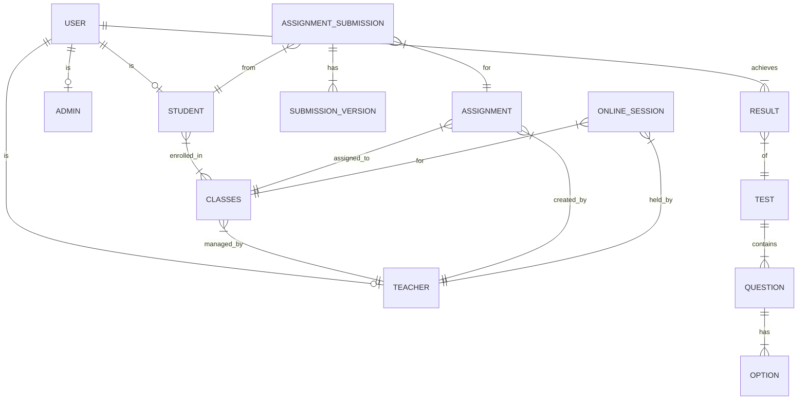

# Database Overview

LingoPulse uses a relational database structure designed to support hierarchical user relationships and complex educational workflows.

## 🗄 Storage Engine
The application is configured to support both **SQLite** (for development/local testing) and **MySQL/PostgreSQL** (for production). Eloquent ORM is used exclusively for all database interactions.

## 🗺 Entity Relationship Diagram (Conceptual)

## 🏗 Key Migration History
- `2026_01_07`: Core system tables (Users, Students, Teachers, Classes, Tests, Questions).
- `2026_02_25`: Introduction of `class_student` pivot table and enrollment fixes.
- `2026_02_27`: Online Sessions, Assignments, and Submission tracking (including versions).
- `2026_02_27`: System-wide notifications infrastructure.

---
Next: [Model Reference](MODELS.md)
